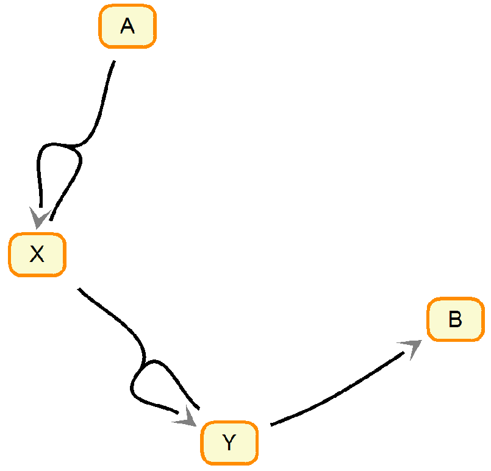

#Intro
[Lotka-Volterra](https://en.wikipedia.org/wiki/Lotka–Volterra_equations) is a small model that describes a number of biological processes. Perhaps the most know example is describing the populations of prey and predator specie. Although the model is (as low as 2 ODE) it possesses some interesting properties that makes it challending and interesting to model.

#Mode Specifications
Let's consider a system of chemical reaction where a substance `A` converts to `B` through a couple of intermediate steps. The chemical reactions equations are as follows. Essentially it maps to a more common prey/predator as `X` is a prey and `Y` is a predator. The specie `A` would be something like grass or whatever the prey feeds on and `B` is a dead predator. I don't think there is an <u>actual</u> system of chemical reactions that is described by Lotka-Volterra. However, there are plenty of more complicated ones like [Belousov–Zhabotinsky reaction](https://en.wikipedia.org/wiki/Belousov–Zhabotinsky_reaction). Nonetheless, the relative simplicity of Lotka-Volterra makes it a great toy example.

\\( A + X \\xrightarrow{k_1} 2 X \\)

\\( X + Y \\xrightarrow{k_2} 2 Y \\)

\\( Y \\xrightarrow{k_3} B \\)

<!-- can't control size this way

-->
<!-- this way has more handle on figure position and size
     Jekyll will look for it in
     http://localhost:4000/blog/figs/2015-11-21-lotka_volterra/lv.png
     Knitr, however does not compile the document.  I need to sort out 
     the paths. -->

<!-- http://localhost:4000/figs/2015-11-21-lotka_volterra/lv.png -->
<!-- http://localhost:4000/blog/figs/2015-11-21-lotka_volterra/lv.png --> 
<!-- http://vladpetyuk.github.io/blog/figs/2015-11-21-lotka_volterra/lv.png -->
<!-- http://localhost:4000/figs/2015-11-21-lotka_volterra/lv.png -->

<left>
<!--  -->

 
<em>Figure made in Systems Biology Workbench</em>
</left>

#ODEs
The set of ordinary differential equations describing the system can be written as follows.

\\( \\frac{dA}{dt} = -k_{1}AX \\)

\\( \\frac{dX}{dt} = k\_{1}AX - k_{2}XY \\)

\\( \\frac{dY}{dt} = k\_{2}XY - k_{3}Y \\)

\\( \\frac{dB}{dt} = k_{3}Y \\)

#Initial Value Problem Solving
[deSolve](https://cran.r-project.org/web/packages/deSolve/index.html) library is a great collection of tools aimed mostly at solving of the initial value problem. The model is specified using a function. In our case it is `chemLV`. There are number of methods for integration. The default is *LSODA*.


library(deSolve)

chemLV <- function(Time, State, Pars) {
    with(as.list(c(State, Pars)), {
        dA <- -k1*A*X
        dX <- k1*A*X - k2*X*Y
        dY <- k2*X*Y - k3*Y
        dB <- k3*Y
        return(list(c(dA,dX,dY,dB)))
    })
}

pars  <- c(k1 = 0.0025,
           k2 = 0.5,
           k3 = 0.02)

yini  <- c(A = 5,
           X = 1e-6,
           Y = 1e-6,
           B = 0)

times <- seq(0, 70000, by = 10)

out <- ode(yini, times, chemLV, pars)


The output in essense is a matrix with additional attributes.


class(out)



## [1] "deSolve" "matrix"



head(out)



##      time        A            X            Y            B
## [1,]    0 5.000000 1.000000e-06 1.000000e-06 0.000000e+00
## [2,]   10 5.000000 1.133326e-06 8.182043e-07 1.818005e-07
## [3,]   20 5.000000 1.284425e-06 6.694955e-07 3.305138e-07
## [4,]   30 5.000000 1.455668e-06 5.478338e-07 4.521796e-07
## [5,]   40 4.999999 1.649743e-06 4.482811e-07 5.517362e-07
## [6,]   50 4.999999 1.869692e-06 3.668192e-07 6.332016e-07


Note the oscillating behaviour of the system. The parameters `pars` and initial concentrations `yini` were set on purpose to produce this beautiful property of this simple system. The oscillations are not a property that is always present. It really depends on the settings. Note, in this chemical reaction, the amplitude of the oscillations is decreasing in time. In case of constant supply of `A` (like grass for a prey specie) the oscillations will be stable.


plot(out)


 

The phase diagram is another way of showing how sytem evolves over time. Note, that at equilibrium, `Y` goes down to 0, while `X` converges somwhere at $$10^{-1.5}$$ = (0.03).


library(ggplot2)
library(vp.misc) # for hot2.colors

input <- data.frame(out, step=seq_len(nrow(out))*10)
ggplot(data=input, aes(x=X, y=Y, color=step)) +
    geom_path(size=2) + 
    scale_x_log10() + scale_y_log10() +
    scale_colour_gradientn(colours=hot2.colors(nrow(input)))


 

