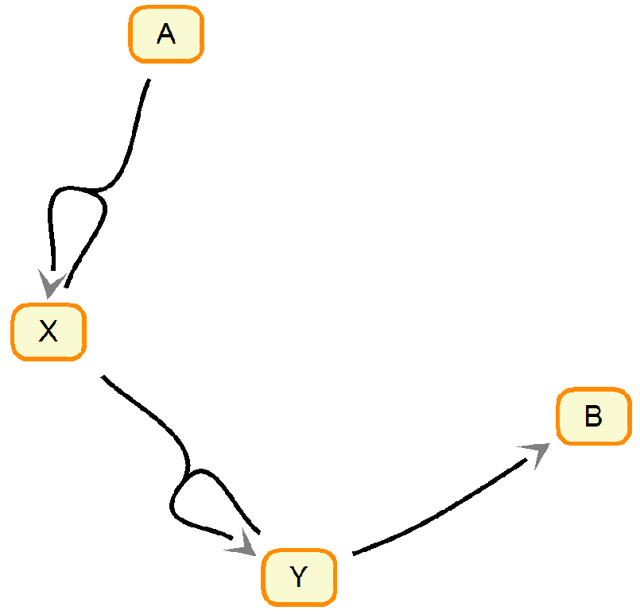

#Intro
[Lotka-Volterra](https://en.wikipedia.org/wiki/Lotka–Volterra_equations) is a small model that describes a number of biological processes. Perhaps the most know example is describing the populations of prey and predator specie. Although the model is (as low as 2 ODE) it possesses some interesting properties that makes it challending and interesting to model.

#Model Specifications
Let's consider a system of chemical reaction where a substance `A` converts to `B` through a couple of intermediate steps. The chemical reactions equations are as follows. Essentially it maps to a more common prey/predator as `X` is a prey and `Y` is a predator. The specie `A` would be something like grass or whatever the prey feeds on and `B` is a dead predator. I don't think there is an <u>actual</u> system of chemical reactions that is described by Lotka-Volterra. However, there are plenty of more complicated ones like [Belousov–Zhabotinsky reaction](https://en.wikipedia.org/wiki/Belousov–Zhabotinsky_reaction). Nonetheless, the relative simplicity of Lotka-Volterra makes it a great toy example.

\\( A + X \\xrightarrow{k_1} 2 X \\)

\\( X + Y \\xrightarrow{k_2} 2 Y \\)

\\( Y \\xrightarrow{k_3} B \\)

<left>

 
<em>
    Diagram of the chemical reactions. The figure made using 
    <a href="http://sbw.sourceforge.net/">Systems Biology Workbench</a>.
</em>
</left>

#ODEs
The set of ordinary differential equations describing the system can be written as follows.

\\( \\frac{dA}{dt} = -k_{1}AX \\)

\\( \\frac{dX}{dt} = k\_{1}AX - k_{2}XY \\)

\\( \\frac{dY}{dt} = k\_{2}XY - k_{3}Y \\)

\\( \\frac{dB}{dt} = k_{3}Y \\)

#Initial Value Problem Solving
[deSolve](https://cran.r-project.org/web/packages/deSolve/index.html) library is a great collection of tools aimed mostly at solving of the initial value problem. The model is specified using a function. In our case it is `chemLV`. There are number of methods for integration. The default is *LSODA*.


library(deSolve)

chemLV <- function(Time, State, Pars) {
    with(as.list(c(State, Pars)), {
        dA <- -k1*A*X
        dX <- k1*A*X - k2*X*Y
        dY <- k2*X*Y - k3*Y
        dB <- k3*Y
        return(list(c(dA,dX,dY,dB)))
    })
}

pars  <- c(k1 = 0.003,
           k2 = 0.03,
           k3 = 0.001)

yini  <- c(A = 1,
           X = 1e-1,
           Y = 1e-1,
           B = 1e-6)

times <- seq(0, 40000, by = 200)
out <- ode(yini, times, chemLV, pars, method = "lsoda")


The output in essense is a matrix with additional attributes.


class(out)



## [1] "deSolve" "matrix"



head(out)



##      time         A          X         Y          B
## [1,]    0 1.0000000 0.10000000 0.1000000 0.00000100
## [2,]  200 0.9444218 0.08614364 0.1450373 0.02439827
## [3,]  400 0.9049258 0.05556381 0.1820355 0.05747585
## [4,]  600 0.8823862 0.03049699 0.1917947 0.09532307
## [5,]  800 0.8703768 0.01677868 0.1800917 0.13275384
## [6,] 1000 0.8635791 0.01016863 0.1594732 0.16678014


Note the oscillating behaviour of the system. The parameters `pars` and initial concentrations `yini` were set on purpose to produce this beautiful property of this simple system. The oscillations are not a property that is always present. It really depends on the settings. Note, in this chemical reaction, the amplitude of the oscillations is decreasing in time. In case of constant supply of `A` (like grass for a prey specie) the oscillations will be stable.


plot(out)


 

The phase diagram is another way of showing how sytem evolves over time. Note, that at equilibrium, `Y` goes down to 0, while `X` converges somwhere at $$10^{-1.5}$$ = (0.03). Perhaps the latter a bit more apparent from the phase diagram below.


library(ggplot2)
library(grid) # for arrow
library(vp.misc) # for hot2.colors

ggplot(data=data.frame(out), aes(x=X, y=Y, color=time)) +
    geom_path(size=1, arrow = arrow(length = unit(7, "points"))) + 
    scale_x_log10() + scale_y_log10() +
    scale_colour_gradientn(colours=hot2.colors(nrow(out)))


 

#Fitting the Model to the Data

##Settings \#1. All parameters are free.
Let's pretend we don't know neither the kinetic parameters nor the initial concentrations of the reagents. Can we infer them from the data? Note, if we use the entire `out` matrix, then it is trivial to find out the initial concentrations. However, such luxury is not always available. For the inverse problem solving we'll take advantage of the [FME](https://cran.r-project.org/web/packages/FME/index.html) package.


library(FME)


Let's define the objective function to be minimized. The core of it is the initial value problem solver `ode`. The output can be presented in the form of error residuals (actual - simulated data). Occasionally the solver will be failing. In this case we return `NaN` as the error residuals. As an alternative that is worth considering is return of error residuals calculated based on incomplete data (commented in the code). Typically such incomplete ODE solutions have very huge errors. Thus there is no chance that the optimization will converge on those values.


err_res_1 <- function(args){
    out.i <- ode(y=args[c('A','X','Y','B')],
                 times=out[,"time"],
                 func=chemLV,
                 parms=args[c('k1','k2','k3')],
                 method="lsoda")
    if(nrow(out.i) < nrow(out))
        return(as.numeric(out[,-1]) - NaN)
    # res <- (out[1:nrow(out.i),] - out.i)[,-1]
    res <- (out - out.i)[,-1]
    return(as.numeric(res))
}


Let's pretend we don't know the parameters and try to infer them from the data. To make it easier on optimization we will supply correct values `yini` for the initial concentrations. Note, we will constrain all parameters with zeros as low values as negative concentrations and kinetic constants do not make sense.


pars.guess  <- c(k1 = 0.1, 
                 k2 = 0.1, 
                 k3 = 0.1)


Checking how different the model looks like with the guessed initial values. Since the guess on kinetic constants was not guided in any way, the model behaviour is strikingly different from the original. In real world scenario, the initial parameter values should be either based on prior knowledge or set in such a way that the model recapitulates at least some of the key features of the original data.


out.guess <- ode(yini, times, chemLV, pars.guess, method = "lsoda")
plot(out.guess)


 

Launching the fitting of the paramters to the data of the original model.


fit <- modFit(f = err_res_1,
              p = c(yini, pars.guess),
              lower = rep(0,7),
              method = "Marq")



summary(fit, cov=FALSE)



## 
## Parameters:
##     Estimate Std. Error t value Pr(>|t|)    
## A  9.499e-01  1.191e-01   7.974 5.31e-15 ***
## X  1.092e-03  7.044e-04   1.550    0.122    
## Y  4.126e-05  3.500e-05   1.179    0.239    
## B  1.255e-13  1.141e-01   0.000    1.000    
## k1 4.670e-02  6.525e-03   7.157 1.87e-12 ***
## k2 2.542e-01  3.558e-02   7.145 2.03e-12 ***
## k3 1.543e-02  7.122e-04  21.662  < 2e-16 ***
## ---
## Signif. codes:  0 '***' 0.001 '**' 0.01 '*' 0.05 '.' 0.1 ' ' 1
## 
## Residual standard error: 0.2254 on 797 degrees of freedom


Despite, the fact that some of the parameter values are claimed as statistically significant, the optimization failed. The inferred parameters are nowhere near the original values. This is not too surprising as non-linear model fitting is a non-trivial task in general. Especially this is the case for tricky models such as Lotka-Volterra that has many local minima. 

Although inferred parameter values are not exactly the same that we put into the simulation, let's check if these parameters reproproduce the data. The data itself, also, not even close as shown below.


out2 <- ode(fit$par[c('A','X','Y','B')], 
           times, chemLV, 
           fit$par[c('k1','k2','k3')], method = "lsoda")
plot(out2)


 

##Settings \#2. Mixed free/fixed parameters.
Let's consider a little bit easier situation. Say we <u>know</u> the initial concentrations. Typically biomolecule concentrations is somewhat realistically to directly measure with bioanalytical approaches. Thus we will consider only three kinetic constants as free parameters for optimization. Note, the initial values remain exactly the same between those two optimizations.


err_res_2 <- function(args){
    out.i <- ode(y=yini,
                 times=out[,"time"],
                 func=chemLV,
                 parms=args[c('k1','k2','k3')],
                 method="lsoda")
    if(nrow(out.i) < nrow(out))
        return(as.numeric(out[,-1]) - NaN)
    res <- (out - out.i)[,-1]
    return(as.numeric(res))
}

pars.guess  <- c(k1 = 0.1, 
                 k2 = 0.1, 
                 k3 = 0.1)

fit <- modFit(f = err_res_2,
              p = pars.guess,
              lower = rep(0,3), 
              method = "Marq")
summary(fit, cov=FALSE)



## 
## Parameters:
##     Estimate Std. Error   t value Pr(>|t|)    
## k1 3.000e-03  1.947e-18 1.541e+15   <2e-16 ***
## k2 3.000e-02  7.720e-18 3.886e+15   <2e-16 ***
## k3 1.000e-03  4.109e-19 2.433e+15   <2e-16 ***
## ---
## Signif. codes:  0 '***' 0.001 '**' 0.01 '*' 0.05 '.' 0.1 ' ' 1
## 
## Residual standard error: 5.49e-16 on 801 degrees of freedom


Success! The fitted values for the three kinetic constants are correct. Note, 
the initial values for the first and second optimizations are the same. 
The algortithm and settings are the same. All we did is fixed the 
initial concentrations and thus did not allow to slip out of the 
path to the actual minimum. Perhaps it is possible to set-up an optimization 
routine that does correct fit even in the case of seven free parameters, but it won't be trivial.

